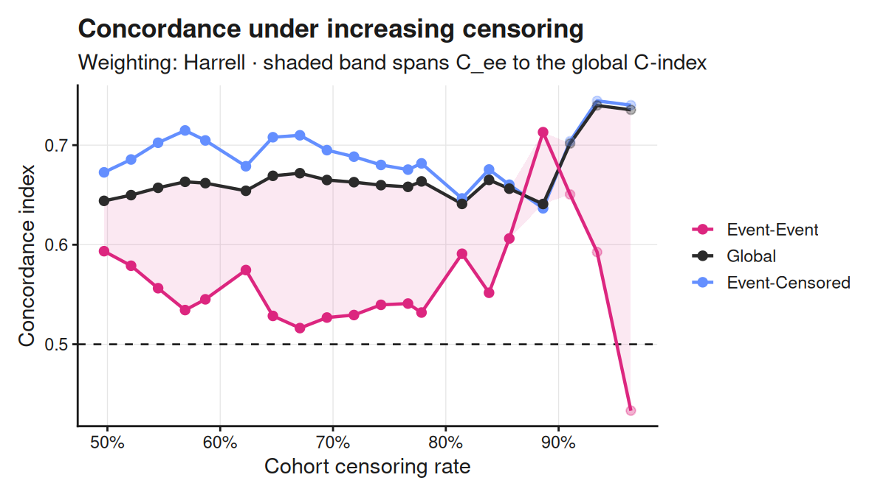
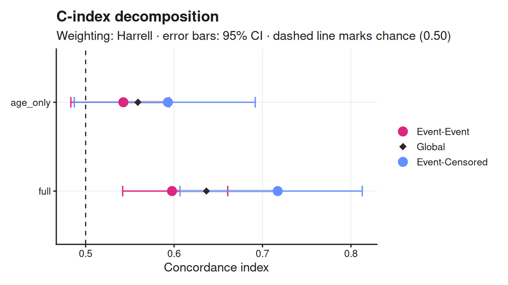

<!-- README.md is generated from README.Rmd. Please edit that file. -->

<!-- Re-render with devtools::build_readme(). -->

# cindexdecomp

> C-Index Decomposition for Survival Models

<!-- badges: start -->

[](https://github.com/Lainsm/cindexdecomp/actions/workflows/R-CMD-check.yaml)
[](https://github.com/Lainsm/cindexdecomp/actions/workflows/pkgdown.yaml)
[](https://app.codecov.io/gh/Lainsm/cindexdecomp)
[](https://lifecycle.r-lib.org/articles/stages.html#experimental)
[](https://opensource.org/licenses/MIT)
<!-- badges: end -->

## Overview

Harrell’s concordance index pools two different ranking tasks:

- **Event-Event pairs (`C_ee`)** — both subjects had the event. The
  harder task.
- **Event-Censored pairs (`C_ec`)** — one had the event, one was
  censored later.

As censoring rises the event-event pairs vanish and `C_ec` dominates the
pooled score, so a model close to chance on true events can still report
a stable global C-index. `cindexdecomp` makes that visible.

## Installation

``` r
# install.packages("pak")
pak::pak("Lainsm/cindexdecomp")
```

## Quick start

``` r
library(cindexdecomp)
library(survival)

lung2 <- lung[complete.cases(lung), ]
cox <- coxph(Surv(time, status - 1) ~ age + sex + ph.ecog, data = lung2)

fit <- decompose_cindex(
  lung2$time,
  lung2$status - 1, # lung codes 1/2; the package expects 0/1
  predict(cox, type = "lp"),
  n_boot = 1000
)
fit
#> C-Index Decomposition
#> Weighting: Harrell | n = 167, events = 120 (71.9%), censoring 28.1%
#> 
#>                     C-index       pairs    share   95% CI
#>   Event-Event        0.5976       7,129    67.5%   [0.5343, 0.6584]
#>   Event-Censored     0.7172       3,435    32.5%   [0.6217, 0.8167]
#>   -----------------------------------------------------------------
#>   Global             0.6365      10,564   100.0%   [0.5773, 0.6954]
#> 
#>   Masking gap (C_ec - C_ee): +0.120   [+0.014, +0.223]
```

``` r
confint(fit)
#>               2.5 %    97.5 %
#> C_ee     0.53433715 0.6584277
#> C_ec     0.62172323 0.8167116
#> C_global 0.57728104 0.6953807
#> gap      0.01398576 0.2227262
```

A formula interface is available too, and takes the data frame directly:

``` r
lung2$lp <- predict(cox, type = "lp")
decompose_cindex(Surv(time, status - 1) ~ lp, data = lung2)
#> C-Index Decomposition
#> Weighting: Harrell | n = 167, events = 120 (71.9%), censoring 28.1%
#> 
#>                     C-index       pairs    share
#>   Event-Event        0.5976       7,129    67.5%
#>   Event-Censored     0.7172       3,435    32.5%
#>   ----------------------------------------------
#>   Global             0.6365      10,564   100.0%
#> 
#>   Masking gap (C_ec - C_ee): +0.120
#>   Pair counts describe composition, not precision. Set n_boot > 0 for intervals.
```

## What the numbers say

On this cohort the global C-index looks respectable, but the split shows
where it comes from: the event-censored pairs score materially higher
than the event-event pairs, and the masking gap quantifies the
difference.

``` r
c(C_ee = fit$C_ee, C_ec = fit$C_ec, C_global = fit$C_global, gap = fit$gap)
#>      C_ee      C_ec  C_global       gap 
#> 0.5976294 0.7171761 0.6365013 0.1195467
```

Because `confint()` bootstraps the gap itself — resampling subjects, not
pairs — you can say whether that gap is distinguishable from zero.

## The identity

Any concordance index that averages over comparable pairs,

    C_w = sum(w_ij * c_ij) / sum(w_ij)

decomposes exactly:

    C_w = (W_ee * C_ee + W_ec * C_ec) / (W_ee + W_ec)

where `W` denotes sums of weights. Setting `w_ij = 1` recovers Harrell’s
C. The identity is verifiable from the returned object:

``` r
with(fit, (W_ee * C_ee + W_ec * C_ec) / (W_ee + W_ec)) - fit$C_global
#> [1] 0
```

## Weightings

| Constructor                | Estimator              |
|----------------------------|------------------------|
| `weights_harrell()`        | Harrell’s C            |
| `weights_uno()`            | Uno’s IPCW C           |
| `weights_truncated(tau)`   | C truncated at `tau`   |
| `weights_custom(fn, name)` | any user-supplied rule |

``` r
decompose_cindex(
  lung2$time, lung2$status - 1, lung2$lp,
  weights = weights_uno()
)
#> C-Index Decomposition
#> Weighting: Uno (IPCW) | n = 167, events = 120 (71.9%), censoring 28.1%
#> 
#>                     C-index       pairs    share
#>   Event-Event        0.5817       7,129    67.5%
#>   Event-Censored     0.6938       3,435    32.5%
#>   ----------------------------------------------
#>   Global             0.6185      10,564   100.0%
#> 
#>   Masking gap (C_ec - C_ee): +0.112
#>   Pair counts describe composition, not precision. Set n_boot > 0 for intervals.
```

The pooled result agrees with `survival::concordance()` to machine
precision for Harrell’s weighting under every tie pattern, and for Uno’s
weighting when event times are distinct. Under tied times, Uno’s
pairwise estimator diverges from the counting-process form in `survival`
by around 1e-04 — immaterial in practice, and explained in the vignette
(`vignette("cindexdecomp")`).

## Tracing the masking

`censoring_curve()` re-applies the decomposition under a sweep of
administrative cut-offs, so you can watch `C_global` hold steady while
`C_ee` moves:

``` r
curve <- censoring_curve(lung2$time, lung2$status - 1, lung2$lp)
autoplot(curve)
```



The global curve holds near 0.65 across the sweep while the event-event
curve falls to chance and below. That divergence is the masking the
package is named for. `autoplot()` is re-exported, so **ggplot2 does not
need to be attached** to get the plot — only to modify it afterwards.

## Comparing models

``` r
risks <- list(
  age_only = predict(coxph(Surv(time, status - 1) ~ age, data = lung2)),
  full = lung2$lp
)

cmp <- compare_decompositions(risks, lung2$time, lung2$status - 1, n_boot = 200)
cmp
#> C-Index Decomposition Comparison
#> Weighting: Harrell | 2 model(s) | n_boot = 200
#> 
#>     model   C_ee   C_ec C_global     gap
#>  age_only 0.5426 0.5930   0.5590 0.05037
#>      full 0.5976 0.7172   0.6365 0.11955
autoplot(cmp)
```



## Functions

| Function | Description |
|----|----|
| `decompose_cindex()` | Decomposes into `C_ee` and `C_ec` |
| `confint()` | Bootstrap intervals, including for the masking gap |
| `censoring_curve()` | Traces the decomposition as censoring rises |
| `compare_decompositions()` | Runs several models over one cohort |
| `autoplot()` | Plots any of the above |
| `theme_cindex()` | Light (default) and dark plot themes |

## Model agnostic

Any model that produces a risk score works:

``` r
decompose_cindex(time, status, predict(cox_fit, type = "lp"))
decompose_cindex(time, status, predict(xgb_fit, xgb.DMatrix(X)))
decompose_cindex(time, status, predict(rsf_fit, newdata = test)$predicted)
```

## Limitations

- Assumes non-informative censoring.
- `C_ee` is imprecise when few event-event pairs exist. Use `confint()`;
  pair counts describe composition, not precision.
- Evaluates discrimination only, not calibration.
- Model-based estimators such as Gönen–Heller are out of scope: they
  integrate over an assumed model rather than counting observed pairs,
  so the event-event partition is undefined for them.

## Citation

``` r
citation("cindexdecomp")
To cite cindexdecomp in publications, use:

  Lainsbury MJ (2026). cindexdecomp: C-Index Decomposition for Survival
  Models. R package version 0.2.0.
  https://github.com/Lainsm/cindexdecomp

A BibTeX entry for LaTeX users is

  @Manual{,
    title = {{cindexdecomp}: C-Index Decomposition for Survival Models},
    author = {Malik J. Lainsbury},
    year = {2026},
    note = {R package version 0.2.0},
    url = {https://github.com/Lainsm/cindexdecomp},
  }
```

## References

Harrell FE et al. (1982) Evaluating the yield of medical tests. *JAMA*,
247(18), 2543-2546.

Uno H et al. (2011) On the C-statistics for evaluating overall adequacy
of risk prediction procedures with censored survival data. *Statistics
in Medicine*, 30(10), 1105-1117.
