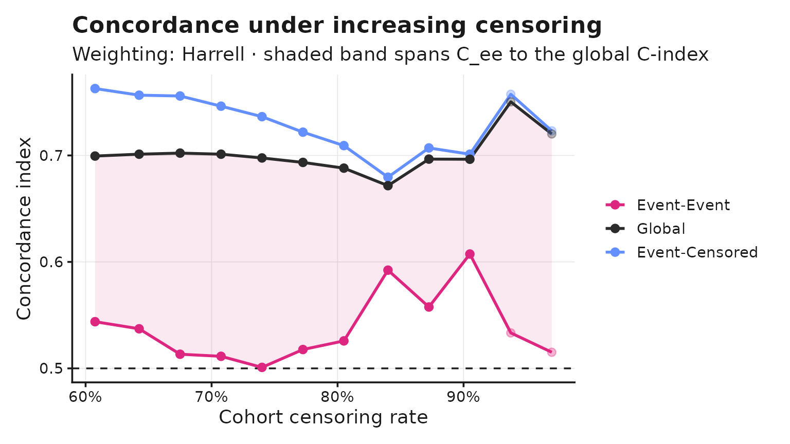
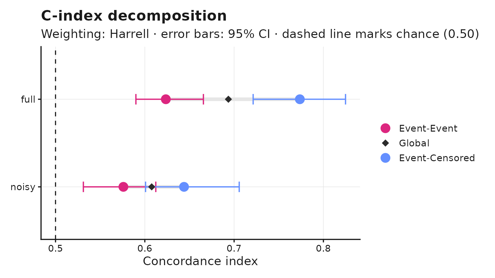

# Decomposing the C-index

``` r

library(cindexdecomp)
library(survival)
```

## The problem

Harrell’s concordance index pools two different ranking tasks. Some
comparable pairs consist of two subjects who both had the event; others
pair an event with a subject censored later. The second task is easier,
and as censoring rises it comes to dominate the pooled score: a model
can report a stable, respectable global C-index while doing no better
than chance at ordering the events it was built to predict.

## The decomposition

Write any concordance index as a weighted average over comparable pairs,

``` math
C_w = \frac{\sum_{ij} w_{ij} c_{ij}}{\sum_{ij} w_{ij}},
```

where $`c_{ij} \in \{0, 0.5, 1\}`$ records whether the pair was ranked
correctly. Splitting the pairs by the status of the later subject gives

``` math
C_w = \frac{W_{ee} C_{ee} + W_{ec} C_{ec}}{W_{ee} + W_{ec}},
```

with $`W`$ denoting sums of weights. The identity holds exactly for
every weighting – it is an algebraic regrouping of the same sum, not an
approximation.

``` r

set.seed(7)
n <- 400
risk <- rnorm(n)
event_time <- rexp(n, rate = exp(0.8 * risk) * 0.1)
cens_time <- rexp(n, rate = 0.08)
time <- pmin(event_time, cens_time)
status <- as.numeric(event_time <= cens_time)

fit <- decompose_cindex(time, status, risk, n_boot = 200)
fit
#> C-Index Decomposition
#> Weighting: Harrell | n = 400, events = 224 (56.0%), censoring 44.0%
#> 
#>                     C-index       pairs    share   95% CI
#>   Event-Event        0.6235      24,976    53.3%   [0.5789, 0.6709]
#>   Event-Censored     0.7736      21,871    46.7%   [0.7236, 0.8228]
#>   -----------------------------------------------------------------
#>   Global             0.6936      46,847   100.0%   [0.6558, 0.7372]
#> 
#>   Masking gap (C_ec - C_ee): +0.150   [+0.101, +0.202]
```

The global figure agrees with
[`survival::concordance()`](https://rdrr.io/pkg/survival/man/concordance.html)
exactly:

``` r

c(
  cindexdecomp = fit$C_global,
  survival = concordance(Surv(time, status) ~ risk, reverse = TRUE)$concordance
)
#> cindexdecomp     survival 
#>    0.6935983    0.6935983
```

## Ties

Three cases arise, and the package follows
[`survival::concordance()`](https://rdrr.io/pkg/survival/man/concordance.html)
in each:

- two events at the same recorded time are **not** comparable;
- an event and a censoring at the same recorded time **are** comparable,
  with the event treated as occurring first;
- equal risk scores receive half credit.

The second case matters in practice because survival times are usually
recorded in whole days, so exact ties are common rather than
exceptional.

## Choosing a weighting

The weighting selects the estimator. One engine produces all of them.

``` r

weightings <- list(
  Harrell   = weights_harrell(),
  Uno       = weights_uno(),
  Truncated = weights_truncated(tau = quantile(time[status == 1], 0.5))
)

do.call(rbind, lapply(names(weightings), function(nm) {
  f <- decompose_cindex(time, status, risk, weights = weightings[[nm]])
  data.frame(
    weighting = nm, C_global = f$C_global,
    C_ee = f$C_ee, C_ec = f$C_ec
  )
}))
#>   weighting  C_global      C_ee      C_ec
#> 1   Harrell 0.6935983 0.6235186 0.7736272
#> 2       Uno 0.6825222 0.6171290 0.7523116
#> 3 Truncated 0.6991953 0.6254797 0.7881967
```

`C_global` varies with the estimator chosen, and every one of those
values is defensible. `C_ee` does not: it stays close to the same figure
throughout, well below `C_ec` in every row. Uno’s inverse-probability
weighting corrects the bias in the pooled estimate; it does not reveal
the composition problem underneath. The masking is a property of the
data, not of the estimator.

A user-supplied weighting needs no changes to the package:

``` r

own <- weights_custom(function(t, G) 1 / G(t), name = "IPCW (power 1)")
decompose_cindex(time, status, risk, weights = own)$C_global
#> [1] 0.6897428
```

### Uno’s C under tied event times

`cindexdecomp` implements Uno’s estimator in its published **pairwise**
form: every comparable pair is weighted by $`1/\hat{G}(T_i)^2`$, where
$`\hat G`$ is the Kaplan-Meier estimate of the censoring distribution.
`survival::concordance(timewt = "n/G2")` uses a counting-process
formulation that applies its weight per event *time* instead. The two
agree to the limit of double-precision arithmetic when event times are
distinct, and diverge materially once times are tied:

``` r

tie_agreement <- function(time, status, risk) {
  ref_h <- concordance(Surv(time, status) ~ risk, reverse = TRUE)$concordance
  ref_u <- concordance(Surv(time, status) ~ risk,
    reverse = TRUE,
    timewt = "n/G2"
  )$concordance
  fit_h <- decompose_cindex(time, status, risk, weights = weights_harrell())
  fit_u <- decompose_cindex(time, status, risk, weights = weights_uno())
  c(harrell = fit_h$C_global - ref_h, uno = fit_u$C_global - ref_u)
}

# Day-scale rounding mimics how survival time is actually recorded (whole
# days), which is what makes exact ties common rather than exceptional.
time_days <- round(time * 30) + 1
lung2 <- lung[complete.cases(lung), ]

tie_raw <- rbind(
  `Continuous times`   = tie_agreement(time, status, risk),
  `Day-scale, rounded` = tie_agreement(time_days, status, risk),
  `survival::lung`     = tie_agreement(lung2$time, lung2$status - 1, lung2$age)
)

tie_tab <- data.frame(
  Data = rownames(tie_raw),
  `Harrell agreement` = formatC(tie_raw[, "harrell"], format = "e", digits = 2),
  `Uno agreement` = formatC(tie_raw[, "uno"], format = "e", digits = 2),
  check.names = FALSE, row.names = NULL
)
knitr::kable(tie_tab, align = c("l", "r", "r"))
```

| Data               | Harrell agreement | Uno agreement |
|:-------------------|------------------:|--------------:|
| Continuous times   |          0.00e+00 |     -6.66e-16 |
| Day-scale, rounded |          1.11e-16 |     -1.69e-04 |
| survival::lung     |          0.00e+00 |      2.75e-04 |

The largest deviation observed here (2.75e-04, in the
[`survival::lung`](https://rdrr.io/pkg/survival/man/lung.html) row) is
roughly two orders of magnitude below the sampling variability of a
global estimate on data of this size – the bootstrap standard deviation
of `C_global` for the fit above is 2.08e-02. It does not affect any
practical conclusion. It is documented because a user cross-checking
against `survival` on tied data would otherwise reasonably suspect a
bug.

The Harrell column is zero to floating-point precision throughout:
exactly `0` for continuous times and for
[`survival::lung`](https://rdrr.io/pkg/survival/man/lung.html), and a
single unit of rounding error (1.11e-16, i.e. one bit) once times are
tied and rounded to whole days. That is agreement to the limit of
double-precision arithmetic, not an approximation.

Per-pair weighting is a requirement here rather than a preference: a
weight attached to an event *time* cannot be partitioned into
event-event and event-censored pair sets, so the decomposition this
package computes could not be defined under the counting-process
formulation. Harrell’s weighting is unaffected and matches
[`survival::concordance()`](https://rdrr.io/pkg/survival/man/concordance.html)
exactly under every tie pattern.

## Inference

Intervals come from resampling **subjects**, not pairs. 400 subjects
generate 46,847 comparable pairs, but the information content is 400
observations: resampling pairs directly gives intervals several times
too narrow.

``` r

confint(fit)
#>              2.5 %    97.5 %
#> C_ee     0.5788960 0.6708794
#> C_ec     0.7236323 0.8227892
#> C_global 0.6558278 0.7371710
#> gap      0.1010719 0.2017780
```

The final row is usually the one of interest. It is computed inside each
replicate, so the correlation between `C_ee` and `C_ec` is carried
through rather than assumed away.

## Censoring curves

[`censoring_curve()`](https://lainsm.github.io/cindexdecomp/reference/censoring_curve.md)
applies a series of administrative cut-offs to the **whole cohort** and
recomputes at each. The reported rate is therefore the cohort’s actual
censoring rate, including subjects censored before any cut-off was
applied.

``` r

cv <- censoring_curve(time, status, risk, n_thresholds = 12)
head(as.data.frame(cv))
#>   threshold censoring      C_ee      C_ec  C_global       gap  N_ee  N_ec
#> 1  6.511773    0.6075 0.5438511 0.7628286 0.6994278 0.2189776 12246 30050
#> 2  5.211322    0.6425 0.5371811 0.7566083 0.7011769 0.2194272 10153 30038
#> 3  4.648526    0.6750 0.5132976 0.7558340 0.7021894 0.2425365  8385 29525
#> 4  3.840164    0.7075 0.5113469 0.7462718 0.7011767 0.2349249  6786 28566
#> 5  3.144365    0.7400 0.5009335 0.7364178 0.6976387 0.2354843  5356 27168
#> 6  2.579053    0.7725 0.5177045 0.7218713 0.6934579 0.2041668  4095 25330
#>   low_precision  W_ee  W_ec
#> 1         FALSE 12246 30050
#> 2         FALSE 10153 30038
#> 3         FALSE  8385 29525
#> 4         FALSE  6786 28566
#> 5         FALSE  5356 27168
#> 6         FALSE  4095 25330
```

``` r

autoplot(cv)
```



Estimates resting on few event-event pairs are flagged in
`low_precision` and drawn faintly. They are never removed, and no value
is discarded for being small: 2 of the 12 thresholds above are flagged,
all at the high-censoring end of the sweep where the flag is meant to
bite.

## Comparing models

``` r

risks <- list(
  full = risk,
  noisy = risk + rnorm(n, sd = 1.5)
)
cmp <- compare_decompositions(risks, time, status, n_boot = 200)
cmp
#> C-Index Decomposition Comparison
#> Weighting: Harrell | 2 model(s) | n_boot = 200
#> 
#>  model   C_ee   C_ec C_global     gap
#>   full 0.6235 0.7736   0.6936 0.15011
#>  noisy 0.5760 0.6439   0.6077 0.06792
```

``` r

autoplot(cmp)
```



Adding noise to the risk score shrinks `C_ee`, `C_ec` and the gap
between them together – a reminder that the gap is a property of a
specific model’s failure mode on this cohort, not a universal constant
to be compared across unrelated studies.

## A worked example

``` r

cox <- coxph(Surv(time, status - 1) ~ age + sex + ph.ecog, data = lung2)
decompose_cindex(
  Surv(time, status - 1) ~ predict(cox, type = "lp"),
  data = lung2,
  n_boot = 200
)
#> C-Index Decomposition
#> Weighting: Harrell | n = 167, events = 120 (71.9%), censoring 28.1%
#> 
#>                     C-index       pairs    share   95% CI
#>   Event-Event        0.5976       7,129    67.5%   [0.5298, 0.6556]
#>   Event-Censored     0.7175       3,435    32.5%   [0.6118, 0.8053]
#>   -----------------------------------------------------------------
#>   Global             0.6366      10,564   100.0%   [0.5726, 0.6955]
#> 
#>   Masking gap (C_ec - C_ee): +0.120   [+0.025, +0.216]
```

Note the `status - 1`: `lung` codes status as 1/2, while the package
expects 0/1. Data already coded 0/1 needs no adjustment.

## Scope

The decomposition applies to any estimator that averages over observed
comparable pairs. Model-based estimators such as Gönen–Heller integrate
over an assumed model rather than counting pairs, so the event-event and
event-censored partition is undefined for them; they are outside the
scope of this package by construction.

Non-informative censoring is assumed throughout. The package evaluates
discrimination only, not calibration.
