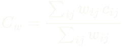
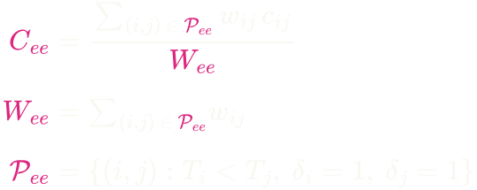
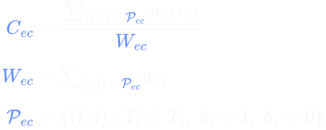

```{r}
#| label: setup
#| include: false

library(survival)
library(ggplot2)
pkgload::load_all(here::here(), quiet = TRUE)

# Mirrors cindexdecomp:::cindex_palette(dark = TRUE); duplicated rather than
# reached for with ::: so the deck does not depend on a non-exported function.
# The two pair-type colours are identical in both variants -- only the
# neutrals change -- so the deck's palette still matches package output.
pal <- list(
  ee     = "#DC267F",
  ec     = "#648FFF",
  global = "#F8F8F2",
  fg     = "#F8F8F2",
  bg     = "#282A36",
  grid   = "#3A3C4E",
  muted  = "#9AA0B8"
)

theme_talk <- function(base_size = 18) {
  theme_cindex(dark = TRUE, base_size = base_size) +
    theme(
      plot.title.position = "plot",
      legend.position = "top",
      legend.title = element_blank(),
      legend.text = element_text(size = rel(0.95))
    )
}
```

```{r}
#| label: cohorts
#| include: false
#| cache: true

# Five published cohorts, all shipped with `survival`, ordered by censoring
# rate. Cached because five bootstraps at n_boot = 1000 is minutes of compute
# and this deck gets re-rendered constantly during rehearsal.
set.seed(2026)
N_BOOT <- 1000

decomp_of <- function(label, disease, time, status, lp) {
  f <- decompose_cindex(time, status, lp, n_boot = N_BOOT)
  ci <- confint(f)
  data.frame(
    cohort    = label,
    disease   = disease,
    n         = f$n,
    cens      = 100 * (1 - f$n_events / f$n),
    ee_share  = 100 * f$W_ee / (f$W_ee + f$W_ec),
    C_ee      = f$C_ee,
    C_ec      = f$C_ec,
    C_global  = f$C_global,
    gap       = f$gap,
    gap_lo    = ci["gap", 1],
    gap_hi    = ci["gap", 2]
  )
}

lung2 <- lung[complete.cases(lung), ]
m_lung <- coxph(Surv(time, status - 1) ~ age + sex + ph.ecog, data = lung2)

colon2 <- colon[
  colon$etype == 2 &
    complete.cases(colon[, c(
      "age", "sex", "obstruct", "nodes", "differ", "extent", "rx"
    )]),
]
m_colon <- coxph(
  Surv(time, status) ~ age + sex + obstruct + nodes + differ + extent + rx,
  data = colon2
)

m_gbsg <- coxph(
  Surv(rfstime, status) ~
    age + meno + size + grade + nodes + pgr + er + hormon,
  data = gbsg
)

m_rott <- coxph(
  Surv(dtime, death) ~
    age + meno + size + grade + nodes + pgr + er + hormon + chemo,
  data = rotterdam
)

flc <- flchain[
  flchain$futime > 0 &
    complete.cases(flchain[, c("age", "sex", "kappa", "lambda", "mgus")]),
]
m_flc <- coxph(
  Surv(futime, death) ~ age + sex + kappa + lambda + mgus,
  data = flc
)

ladder <- rbind(
  decomp_of(
    "lung", "NSCLC", lung2$time, lung2$status - 1,
    predict(m_lung, type = "lp")
  ),
  decomp_of(
    "colon", "Colon cancer", colon2$time, colon2$status,
    predict(m_colon, type = "lp")
  ),
  decomp_of(
    "gbsg", "Breast cancer", gbsg$rfstime, gbsg$status,
    predict(m_gbsg, type = "lp")
  ),
  decomp_of(
    "rotterdam", "Breast cancer", rotterdam$dtime, rotterdam$death,
    predict(m_rott, type = "lp")
  ),
  decomp_of(
    "flchain", "General population", flc$futime, flc$death,
    predict(m_flc, type = "lp")
  )
)
ladder <- ladder[order(ladder$cens), ]
rownames(ladder) <- NULL

fmt <- function(x, d = 3) formatC(x, format = "f", digits = d)
pc <- function(x, d = 1) paste0(formatC(x, format = "f", digits = d), "%")
```

```{r}
#| label: cohort-years
#| include: false

# Deliberately NOT inside the cached `cohorts` chunk: adding metadata there
# would change that chunk's code and invalidate five bootstraps of compute.
# rotterdam and flchain carry their own study years; the other three are from
# the survival package's documentation (Loprinzi 1994; Laurie 1989; gbsg is
# documented as a 1984-1989 trial).
yrs <- c(
  lung      = "1994",
  colon     = "1989",
  gbsg      = "1984-1989",
  rotterdam = paste(range(rotterdam$year), collapse = "-"),
  flchain   = paste(range(flc$sample.yr), collapse = "-")
)
ladder$years <- unname(yrs[ladder$cohort])
stopifnot(!anyNA(ladder$years))
```

```{r}
#| label: fns-tasks
#| include: false

# Slide 5's timeline figure, built in stages so the versions can be stacked as
# reveal.js fragments and appear to draw themselves. Layout is identical at
# every stage -- later elements are drawn transparent rather than omitted --
# so nothing shifts as the build advances.
patients <- data.frame(
  id    = factor(c("B", "A", "D", "C"), levels = c("B", "A", "D", "C")),
  pair  = c("Pair 1", "Pair 1", "Pair 2", "Pair 2"),
  stop  = c(400, 200, 800, 200),
  event = c(TRUE, TRUE, FALSE, TRUE)
)
patients$panel <- factor(
  ifelse(
    patients$pair == "Pair 1",
    "Pair 1  ·  both died",
    "Pair 2  ·  one died, one left alive"
  ),
  levels = c("Pair 1  ·  both died", "Pair 2  ·  one died, one left alive")
)

task_plot <- function(stage = 3) {
  d <- patients
  d$vis <- ifelse(d$pair == "Pair 1" | stage >= 2, 1, 0)
  d$col <- ifelse(d$pair == "Pair 1", pal$ee, pal$ec)

  # y = 1.5 sits midway between the two patients in each panel. Each panel
  # carries exactly two discrete levels under scales = "free_y", so anything
  # above 2 would be clipped.
  labs_df <- data.frame(
    panel = factor(levels(patients$panel), levels = levels(patients$panel)),
    x = 880,
    y = 1.5,
    lab = c("ORDERING\nhard", "DETECTION\neasy"),
    col = c(pal$ee, pal$ec),
    vis = if (stage >= 3) 1 else 0
  )

  ggplot(d, aes(y = id)) +
    geom_segment(
      aes(x = 0, xend = stop, yend = id, colour = col, alpha = vis),
      linewidth = 2.4, lineend = "round"
    ) +
    geom_point(
      data = d[d$event, ],
      aes(x = stop, colour = col, alpha = vis),
      shape = 4, size = 7, stroke = 2.4
    ) +
    geom_point(
      data = d[!d$event, ],
      aes(x = stop, colour = col, alpha = vis),
      shape = 21, size = 6, stroke = 2.4, fill = pal$bg
    ) +
    geom_text(
      data = labs_df,
      aes(x = x, y = y, label = lab, colour = col, alpha = vis),
      hjust = 1, vjust = 0.5, size = 5.4, fontface = "bold", lineheight = 0.95
    ) +
    scale_colour_identity() +
    scale_alpha_identity() +
    # Panel 2's strip title is blanked until its data appears, so stage 1 does
    # not telegraph the reveal. The strip keeps its height either way, so the
    # layout still does not shift between fragments.
    facet_wrap(
      ~panel, ncol = 1, scales = "free_y",
      labeller = as_labeller(stats::setNames(
        c(levels(patients$panel)[1], if (stage >= 2) levels(patients$panel)[2] else " "),
        levels(patients$panel)
      ))
    ) +
    scale_x_continuous(
      "days since enrolment",
      limits = c(0, 900), breaks = seq(0, 800, 200), expand = expansion(c(0.01, 0.02))
    ) +
    labs(y = NULL) +
    theme_talk(16) +
    theme(
      strip.background = element_blank(),
      # theme_cindex() does not set strip.text, so it keeps theme_classic()'s
      # near-black grey10 and disappears against the dark ground. Set here
      # rather than inherited.
      strip.text = element_text(
        hjust = 0, face = "bold", size = rel(1.0), colour = pal$fg
      ),
      panel.grid.major.y = element_blank(),
      axis.line.y = element_blank(),
      axis.ticks.y = element_blank()
    )
}
```

## The number we all report {.smaller}

In a systematic review of machine learning for cancer survival analysis, **85%**
of studies reported the C-index, most of them as a single pooled number
[@odonnellSystematicReviewMachine2025].

::: {.big-stat}
C = 0.65
:::

Read as: *the probability the model ranks a random pair correctly.*

::: {.fragment .highlight-q}
**Which pairs?**
:::

::: {.notes}
Plant the question here and do not answer it. Everything for the next twelve
minutes is an answer to "which pairs".
:::

## Discrimination is one axis among several {.smaller}

| | what it asks |
|---|---|
| **Brier score / IBS** | are the predicted probabilities accurate? |
| **Time-dependent AUC** | does it discriminate *at this horizon*? |
| **Calibration slope / CITL** | do predicted risks match observed ones? |
| **Royston–Sauerbrei D** | how far apart are the risk groups? |
| **C-index** | does it get the *ordering* right? |

::: {.fragment}
Every one of these is better suited to some questions than the C-index is.
**They are also barely used.** In that review, the C-index was not just the
most common metric: for most studies it was the *only* one reported
[@odonnellSystematicReviewMachine2025].
:::

::: {.fragment .highlight-q}
So this talk is not "C is the wrong metric". It is: the number that 85% of the
field reports **on its own** hides its own composition, and almost nobody looks.
:::

::: {.notes}
Scope-setting, and it earns the rest of the talk: the reason to spend fifteen
minutes on one metric is that for most published models it is the only
evidence on offer. Without this slide someone spends your question time
asking why you ignored calibration.
:::

## You are not the first to be suspicious {.smaller}

There is a live argument in the methods literature that the C-index is asked
to carry more than it can. Four distinct complaints:

::: {.steps}
::: {.step}
**It is not a proper scoring rule.** For $t$-year predicted risks, a model
that is *not* the true model can score higher than the true one
[@blancheCindexNotProper2019].
:::

::: {.step}
**It is under-specified in practice.** Several inequivalent estimators travel
under one name, and the choice often goes unreported, which leaves room for
C-hacking [@sonabendAvoidingChackingWhen2022].
:::

::: {.step}
**Defensible choices disagree.** Walk the space of reasonable analytic
choices and the number moves materially: a C-index multiverse
[@sierraCindexMultiverse2025].
:::

::: {.step}
**It is misaligned with what people claim.** The metric reported often does
not match the modelling objective stated in the same paper
[@lillelundPositionStopChasing2025].
:::
:::

::: {.fragment .highlight-q}
This talk is a fifth complaint, and it is the most basic one: **the pooled
index hides its own composition** [@alabdallahConcordanceIndexDecomposition2024].
:::

::: {.notes}
Two purposes. First, a student audience should hear that scepticism about the
C-index is mainstream methods work, not a personal hobby-horse. Second, it
credits Alabdallah et al., whose paper introduced the decomposition: say out
loud that the decomposition is theirs and that the contribution here is a
tested, general R implementation of it. Claiming the method would be the one
thing this room would not forgive.
:::

## Censoring is a partial outcome {.smaller}

A patient who leaves the study alive at day 800 has not gone missing. You
know something real: **they survived at least 800 days.**

::: {.fragment}
To score a model you compare *pairs* of patients. But some pairs cannot be
ordered at all:
:::

::: {.fragment}
> Two patients both left alive: one at 200 days, one at 400.
> Which had the higher risk? **Unanswerable.**
:::

::: {.fragment .highlight-q}
Those pairs are dropped before any score is computed.<br>
The pairs that *survive* that filter are the ones that make your number.
:::

## Two pairs. Two very different questions. {.smaller}

```{r}
#| label: tasks-1
#| fig-height: 4.4
task_plot(1)
```

::: {.notes}
Ask the room out loud: which of these two had the higher risk? Let the silence
sit -- it is genuinely hard. Then advance.
:::

## Two pairs. Two very different questions. {.smaller visibility="uncounted"}

```{r}
#| label: tasks-2
#| fig-height: 4.4
task_plot(2)
```

::: {.notes}
Now ask again for pair 2. The room answers instantly. That gap in response
time IS the talk.
:::

## Two pairs. Two very different questions. {.smaller visibility="uncounted"}

```{r}
#| label: tasks-3
#| fig-height: 4.4
task_plot(3)
```

::: {.fragment .highlight-q}
Different questions, and C averages them into one score.
:::

## The mix is set by your study, not your model {.smaller .centred}

::: {.columns}
::: {.column width="50%"}
**Event-event pairs**

Need *two* events.

As censoring rises they thin out **quadratically**.

::: {.ee-tag}
the hard task
:::
:::

::: {.column width="50%"}
**Event-censored pairs**

Need *one* event.

They persist.

::: {.ec-tag}
the easy task
:::
:::
:::

::: {.fragment .highlight-q}
So the easy task's weight in your average grows with your **censoring rate**:
a property of follow-up and study design, **not of the model you built.**
:::

::: {.notes}
This is the mechanism, complete, with no algebra shown. If they only remember
one slide, it should be the previous one; if they remember two, this one.
:::

# Five cohorts {.section-break}

## Five published cohorts, five Cox models {.smaller}

```{r}
#| label: cohort-list
#| output: asis
# Rendered as a list rather than a table: five rows of six columns forced the
# type down to a size that does not read from the back of a room.
covars <- c(
  lung      = "age, sex, ECOG performance score",
  colon     = "age, sex, obstruction, nodes, differentiation, extent, treatment",
  gbsg      = "age, menopause, size, grade, nodes, PgR, ER, hormone therapy",
  rotterdam = "the gbsg covariates, plus chemotherapy",
  flchain   = "age, sex, kappa, lambda, MGUS"
)
for (i in seq_len(nrow(ladder))) {
  r <- ladder[i, ]
  cat(sprintf(
    "::: {.cohort}\n[%s]{.co-name} [%s, %s]{.co-what}\n\n[n = %s  ·  %s censored]{.co-n} [%s]{.co-cov}\n:::\n\n",
    r$cohort, r$disease, r$years, format(r$n, big.mark = ","),
    pc(r$cens), covars[[r$cohort]]
  ))
}
```

::: {.fragment .highlight-q}
Unrelated diseases. Different covariates. Different decades.
:::

::: {.notes}
Say verbally that the rows are ordered by censoring rate, and that this is the
one thing varying systematically across them. Also say, once, that these are
Cox proportional-hazards models on complete cases and that the C-indices are
apparent rather than cross-validated: n far exceeds p in all five, so the
optimism is small, and it cannot manufacture the pattern because it would
inflate both halves of the split together.
:::

## So how is that number actually built? {.smaller}

Take two patients. If you can tell which of them failed first, ask the model
which one it thought was the riskier bet. It either got that right or it did
not.

::: {.fragment}
Do that for every pair you can order, and count how often the model was right.
That proportion is Harrell's C. A tie counts as half a success; pairs you
cannot order at all, because both were still alive when you lost sight of
them, never enter the count.
:::

::: {.fragment .highlight-q}
And here is the part that matters for the rest of this talk: **every pair that
survives that filter counts exactly the same.** A pair of deaths and a death
measured against a survivor both carry a weight of one, however differently
hard those two comparisons are.
:::

::: {.notes}
About 45 seconds, told rather than recited. It exists so C_global on the next
slide is not a black box, and so that w = 1 in the identity later lands as a
choice somebody made rather than as notation.
:::

## Read the global column first {.smaller}

:::{.centre-table}
```{r}
#| label: ladder-global
tab <- data.frame(
  Cohort = ladder$cohort,
  Censoring = pc(ladder$cens),
  `C_global` = fmt(ladder$C_global),
  check.names = FALSE
)
knitr::kable(tab, align = "lll")
```
:::

::: {.fragment .highlight-q .center}
`r fmt(min(ladder$C_global))` to `r fmt(max(ladder$C_global))` as censoring
goes from `r pc(min(ladder$cens), 0)` to `r pc(max(ladder$cens), 0)`.
:::

::: {.notes}
Let them read it as model quality.  Read
alone, this column says the models are improving. Do not correct it yet. The next slide is
the whole talk.
:::


## The pooled score tracks the censoring rate {.smaller}

::: {.centre-table}
```{r}
#| label: global-trend
#| fig-height: 5.3
ggplot(ladder, aes(cens, C_global)) +
  geom_hline(yintercept = 0.5, linetype = "dashed",
             colour = pal$muted, linewidth = 0.5) +
  annotate("text", x = 25, y = 0.477, label = "chance", hjust = 1,
           size = 4.2, colour = pal$muted) +
  # A faint connector in censoring order, not a fitted line. C_global is
  # strictly monotone across all five, so this traces the ordering that is
  # actually there rather than asserting a model.
  geom_line(colour = pal$global, linewidth = 0.6, alpha = 0.35,
            linetype = "22") +
  geom_point(colour = pal$global, size = 6) +
  ggrepel::geom_text_repel(
    aes(label = cohort), size = 4.3, colour = pal$fg, seed = 7,
    nudge_y = -0.05, direction = "x", segment.colour = NA, box.padding = 0.25
  ) +
  scale_x_continuous(
    "Cohort Censoring Rate", labels = function(x) paste0(x, "%"),
    limits = c(20, 80), breaks = seq(20, 80, 10)
  ) +
  scale_y_continuous("Global C-index", limits = c(0.44, 0.85),
                     breaks = seq(0.5, 0.8, 0.1)) +
  theme_talk(17)
```
:::


::: {.notes}
Do not concede anything yet. Let the room accept the rising line as model
quality; the next two slides take it away.
:::

## Now add the event-event column {.smaller visibility="uncounted"}

```{r}
#| label: ladder-full
tab <- data.frame(
  Cohort = ladder$cohort,
  Censoring = pc(ladder$cens),
  `EE share` = pc(ladder$ee_share),
  `C_ee` = fmt(ladder$C_ee),
  `C_ec` = fmt(ladder$C_ec),
  `C_global` = fmt(ladder$C_global),
  `Gap [95% CI]` = paste0(
    fmt(ladder$gap), "  [", fmt(ladder$gap_lo), ", ", fmt(ladder$gap_hi), "]"
  ),
  check.names = FALSE
)
knitr::kable(tab, align = "lrrrrrr")
```

::: {.fragment .highlight-q}
`C_ee` is **flat**: `r fmt(min(ladder$C_ee))` to `r fmt(max(ladder$C_ee))` across
all five. Every one of these models is about equally poor at ordering real
events.
:::

::: {.notes}
Only C_global is strictly monotone. Do NOT claim a monotone trend in the gap:
colon (0.093) and gbsg (0.100) both sit below lung (0.120). If asked, say so
plainly -- the flat C_ee column is the load-bearing fact, not the gap.
:::


## The two halves, side by side {.smaller}

::: {.centre-table}
```{r}
#| label: ee-ec-bars
#| fig-height: 4.3
bars <- rbind(
  data.frame(cohort = ladder$cohort, cens = ladder$cens,
             C = ladder$C_ee, which = "C_ee   event-event pairs"),
  data.frame(cohort = ladder$cohort, cens = ladder$cens,
             C = ladder$C_ec, which = "C_ec   event-censored pairs")
)
# cohorts stay in censoring order; C_ee first so magenta leads each group
bars$cohort <- factor(bars$cohort, levels = ladder$cohort)
bars$which <- factor(bars$which, levels = c(
  "C_ee   event-event pairs", "C_ec   event-censored pairs"
))
lab <- setNames(paste0(ladder$cohort, "\n", pc(ladder$cens, 0)), ladder$cohort)

ggplot(bars, aes(cohort, C, fill = which)) +
  geom_col(position = position_dodge(width = 0.72), width = 0.62) +
  geom_text(
    aes(label = fmt(C, 2)), position = position_dodge(width = 0.72),
    vjust = -0.55, size = 4.1, colour = pal$fg
  ) +
  geom_hline(yintercept = 0.5, linetype = "dashed",
             colour = pal$muted, linewidth = 0.5) +
  scale_fill_manual(values = c(pal$ee, pal$ec)) +
  scale_x_discrete(NULL, labels = lab) +
  # "chance" rides a right-hand axis rather than an in-panel annotation: bars
  # start at zero, so every in-panel position collides with one.
  scale_y_continuous(
    "C-index", limits = c(0, 0.95), breaks = seq(0, 0.8, 0.2),
    expand = expansion(c(0, 0.02)),
    sec.axis = dup_axis(breaks = 0.5, labels = "chance", name = NULL)
  ) +
  theme_talk(16)
```
:::

::: {.fragment .highlight-q}
The blue bars carry the score. The magenta bars barely move, and the
shortest of them belongs to the cohort with the **highest** reported C.
:::

::: {.notes}
Bars start at zero deliberately. If asked why they are not truncated at 0.5:
because a truncated baseline would exaggerate exactly the effect being
claimed, and the effect does not need the help.
:::

```{r}
#| label: punchline-values
#| include: false
f <- ladder[ladder$cohort == "flchain", ]
```

## The same model, scored two ways {.smaller}

[C_global]{.stat-name}

::: {.big-stat}
`r fmt(f$C_global)`
:::

A number anyone would write up as a good model.

::: {.fragment}
[C_ee]{.stat-name .ee-colour}

::: {.big-stat .ee-colour}
`r fmt(f$C_ee)`
:::
On the pairs where both patients actually had the event.
:::

::: {.fragment .highlight-q}
**The honest caveat:** five different diseases, five different covariate
sets. Censoring is confounded with everything.<br>
**The answer:** `C_ee` sits at `r fmt(min(ladder$C_ee))` to `r fmt(max(ladder$C_ee))`
in *all five*. No disease-specific story accounts for that.
:::

::: {.notes}
Concede the confounding BEFORE they raise it. You cut the within-cohort
censoring sweep from this deck, so this concession is your only defence --
deliver it deliberately, not defensively.
:::

# The decomposition {.section-break}

## It is an identity, not an estimator {.smaller .big-math}

Any concordance index that averages over comparable pairs

<!-- Both formulas are SVGs from formulas/render.cjs rather than MathJax: the
split carries the deck's pair-type colours, and the two need one font and one
scale. Each width is the SVG's natural width (printed by render.cjs) x 1.8. -->
{width="13.73em" fig-alt="C_w equals the sum over pairs of w_ij times c_ij, divided by the sum over pairs of w_ij."}

splits **exactly**:

{width="20.86em" fig-alt="C_w equals W_ee times C_ee plus W_ec times C_ec, divided by W_ee plus W_ec."}

::: {.fragment .highlight-q}
No new estimator. No added assumptions.<br>
**You already computed these. You averaged them away.**
:::

::: {.fragment}
Matches `survival::concordance()` to machine precision, every tie pattern.
:::

## Each half is the same average, over its own pairs {.smaller .centred}

Sort the comparable pairs by what happened to the later patient, *j*.

::: {.columns}
::: {.column width="50%"}
{width="18.3em" fig-alt="C_ee is the sum of w_ij times c_ij over the event-event pairs, divided by W_ee, the sum of their weights. Event-event pairs have T_i less than T_j, delta_i equal to 1 and delta_j equal to 1."}

::: {.ee-tag}
the hard task
:::
:::

::: {.column width="50%"}
{width="18.3em" fig-alt="C_ec is the sum of w_ij times c_ij over the event-censored pairs, divided by W_ec, the sum of their weights. Event-censored pairs have T_i less than or equal to T_j, delta_i equal to 1 and delta_j equal to 0."}

::: {.ec-tag}
the easy task
:::
:::
:::

::: {.fragment .highlight-q}
Same weights, same scoring. The two definitions differ only in *δ*~*j*~.
:::

::: {.notes}
Read the symbols once: T is observed follow-up time, delta = 1 means the
event was seen, and i is always the patient who had the event first. The one
asymmetry is the tie rule: an event and a censoring on the same day count,
with the event taken first, hence the less-than-or-equal in P_ec; two events
on the same day do not count at all. That is survival::concordance()'s rule.
Point at the W's: they are the weights in the identity on the previous slide,
and censoring shrinks W_ee far faster than W_ec.
:::

## You cannot escape this by... {.smaller}

::: {.fragment .escape-row}
**...using a better estimator.**
The identity holds for *any* pair-weighted C: Harrell, Uno's IPCW,
time-truncated. Uno's C *reweights* the pairs. It still
[pools]{.pool} them.
:::

::: {.fragment .escape-row}
**...using a better model.**
The decomposition consumes three vectors: time, status, risk score. It does
not know what produced the score. Cox, gradient boosting, random survival
forest and a deep net all decompose identically.
:::

::: {.fragment .escape-row}
**...because [pooling]{.pool} is a convention, not a law.**
Nobody chose it deliberately. Subgroup reporting is routine elsewhere in the
very same papers. The ask is a *split* of the metric you already use.
:::

::: {.fragment .highlight-q}
Masking is a property of **the metric and the cohort**, not of the model
class. These five are all Cox only so the comparison is like-for-like.
:::

::: {.notes}
The middle bullet is aimed squarely at this room: a student audience assumes
this is a classical-regression problem and their ML pipeline is exempt.
It is not.
:::

## What this does not do {.smaller}

- Assumes **non-informative censoring**.
- `C_ee` is imprecise when event-event pairs are scarce: pair counts
  describe *composition*, not *precision*. (`lung`: gap CI
  [`r fmt(ladder$gap_lo[ladder$cohort == "lung"], 2)`,
  `r fmt(ladder$gap_hi[ladder$cohort == "lung"], 2)`] on n = 167.)
- **Discrimination only.** Says nothing about calibration.
- Model-based estimators like **Gönen–Heller are out of scope by
  construction**: they integrate over an assumed model rather than counting
  observed pairs, so the event-event partition is undefined for them.

::: {.notes}
Volunteer these. A peer room respects the speaker who names their own limits
before the audience does, and it removes the cheapest questions.
:::

## Check your C-index {.smaller}

::: {.checklist}
::: {.check}
[Report the censoring rate beside the score.]{.do}
[printed in every result header]{.how}
:::

::: {.check}
[Report `C_ee`, not the pooled number alone.]{.do}
[`fit$C_ee`]{.how}
:::

::: {.check}
[Say whether the gap is distinguishable from zero.]{.do}
[`confint(fit)`]{.how}
:::

::: {.check}
[Show it is not an artefact of the estimator.]{.do}
[`weights_uno()`]{.how}
:::

::: {.check}
[Compare models on the same split, not the pooled score.]{.do}
[`compare_decompositions()`]{.how}
:::
:::

::: {.fragment .highlight-q}
All five come off one call: `decompose_cindex(time, status, risk_score)`.
A stable global C under heavy censoring is **not** evidence of a stable model.
:::

::: {.install}
`pak::pak("Lainsm/cindexdecomp")` · [lainsm.github.io/cindexdecomp](https://lainsm.github.io/cindexdecomp)
:::

# Backup {visibility="uncounted"}

## Does Uno's weighting rescue it? {.smaller visibility="uncounted"}

```{r}
#| label: uno-ladder
#| cache: true
set.seed(2026)
uno_row <- function(label, time, status, lp) {
  f <- decompose_cindex(time, status, lp, weights = weights_uno())
  data.frame(
    Cohort = label, `C_ee` = f$C_ee, `C_ec` = f$C_ec,
    `C_global` = f$C_global, Gap = f$gap, check.names = FALSE
  )
}
uno <- rbind(
  uno_row("lung", lung2$time, lung2$status - 1, predict(m_lung, type = "lp")),
  uno_row("colon", colon2$time, colon2$status, predict(m_colon, type = "lp")),
  uno_row("gbsg", gbsg$rfstime, gbsg$status, predict(m_gbsg, type = "lp")),
  uno_row("rotterdam", rotterdam$dtime, rotterdam$death,
          predict(m_rott, type = "lp")),
  uno_row("flchain", flc$futime, flc$death, predict(m_flc, type = "lp"))
)
uno[, 2:5] <- lapply(uno[, 2:5], fmt)
knitr::kable(uno, align = "lrrrr")
```

Same pattern. Reweighting the pairs does not stop them being pooled.

## Weightings {.smaller visibility="uncounted"}

| Constructor | Estimator |
|---|---|
| `weights_harrell()` | Harrell's C |
| `weights_uno()` | Uno's IPCW C |
| `weights_truncated(tau)` | C truncated at `tau` |
| `weights_custom(fn, name)` | any user-supplied rule |

Under tied event times Uno's pairwise estimator diverges from the
counting-process form in `survival` by around `1e-04`, immaterial in
practice and explained in `vignette("cindexdecomp")`.

## The models {.smaller visibility="uncounted"}

| Cohort | Model |
|---|---|
| `lung` | `age + sex + ph.ecog` |
| `colon` | `age + sex + obstruct + nodes + differ + extent + rx` |
| `gbsg` | `age + meno + size + grade + nodes + pgr + er + hormon` |
| `rotterdam` | `+ chemo` |
| `flchain` | `age + sex + kappa + lambda + mgus` |

All Cox, all complete cases, `n_boot = `r N_BOOT``, `set.seed(2026)`.
All five ship with the `survival` package.

## References {.smaller visibility="uncounted"}

::: {.refs-slide}
::: {#refs}
:::
:::
